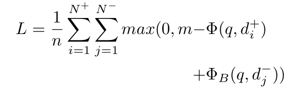
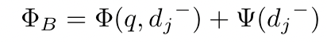
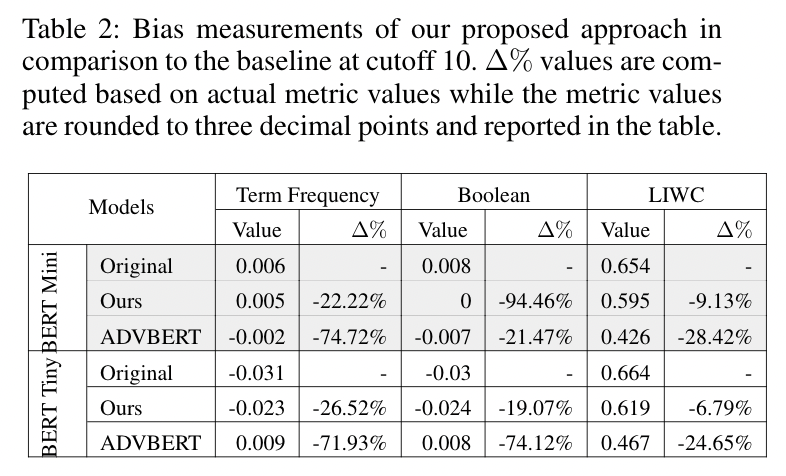
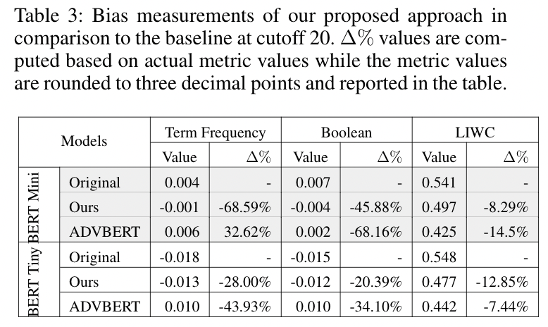
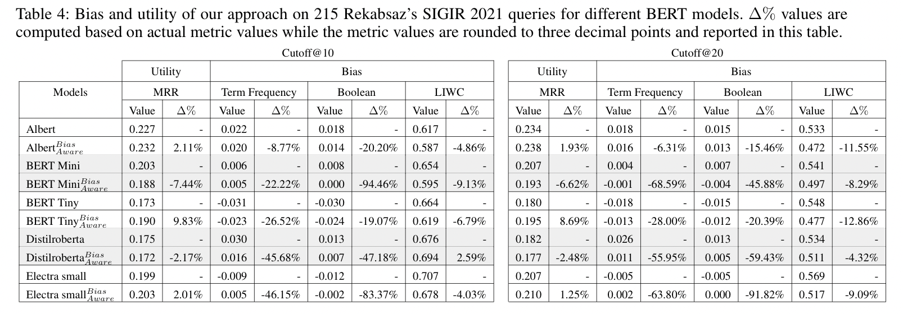
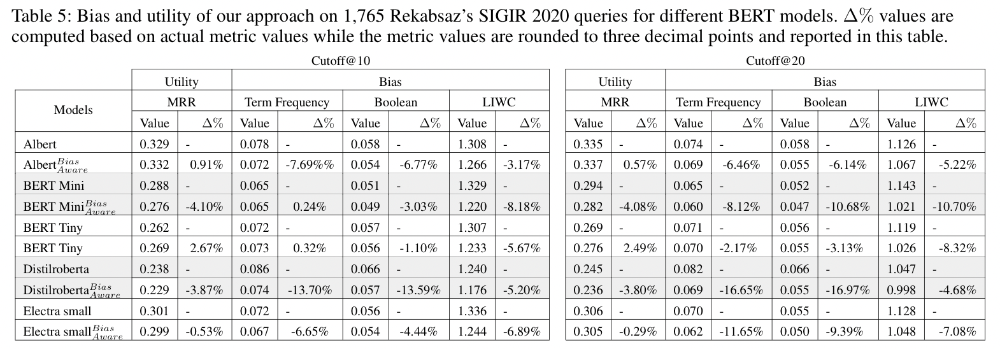

# The Systematic Reduction of Gender Biases in Neural Rankers
This repository contains the code and resources for the paper "The Systematic Reduction of Gender Biases in Neural Rankers".
The objective of this work is to show
that it is possible to maintain competitive retrieval effectiveness
while reducing gender biases.
To this end,
we propose a bias-aware training loss function for neural ranking
methods that explicitly considers the degree of measurable gender
biases associated with negatively sampled documents. We penalize the biased relevant documents as 
follows where $\Psi({d_i}^+)$ measures the gender bias of ${d_i}^+$. We propose
that including a bias term associated with negative samples in the loss
function can ensure that the model learns to avoid representations
that are affiliated with gender biases and at the same time it learns
accurate relevance relationships based on positive instances. In
other words, the model will learn to avoid biased representations
through the bias term associated with negative samples and will also
learn relevance through the associations learnt based on the positive
documents. Therefore, such a loss function strives to maintain its
retrieval effectiveness while reducing gender bias. The proposed loss function is defined as 
follows:

where

We evaluate our approach by measuring the geneder bias in the retrieved lists
of queries for our bias-aware expansion method against ADVBERT.  Associated run files
for each of the methods can be found
in [results/runs](Results/Runs) 
directory.

## Usage

##### In order to obtain a less biased neural ranker on the proposed bias-aware loss function, one should replicate the following steps:

1. use `ARaB/documents_calculate_bias.py` script to calculate the bias level of the documents of the given collection.

2. Creat a new training set which contains the amount of boolean ARaB for each document. 
   The new training set can be formed by adding the boolean ARaB measure of each document as the 
   final column of the original MSMARCO training set. Format of the new training set will be:
   
`<query, doc_positive_doc_negative, bias_doc_negative>`

3. Run `train_bias_aware.py` to train the model.
The command should be as follows:

`python train_bias_aware.py -model bert -train 
./data/bias_dataset.tsv -dev ./data/dev.jsonl -save 
./checkpoints/bert-tiny_bias-aware.bin
-qrels ./data/qrels.dev.tsv -vocab prajjwal1/bert-mini 
-pretrain prajjwal1/bert-mini -res ./results/bert-tiny_bias-aware.trec
-metric mrr_cut_10 -batch_size 16 -max_input 12800000 -epoch 1 
-eval_every 10000 -max_doc_len 221 -max_query_len 32 -lr 3e-6 -n_warmup_steps 160000`

4. Run `inference.py` to retrieve the relevant documents of the dev srt queries. that is forked into [this repository](https://github.com/biasenthusiast1/OpenMatch).
The command should be as follows:

`python inference.py -task ranking -model bert -max_input 60000000 -vocab prajjwal1/bert-tiny -pretrain prajjwal1/bert-tiny -checkpoint ./checkpoints/bert-tiny_bias-aware.bin -res ./results/bias_inferences/inference_bert-tiny_bias-aware.trec -max_query_len 32 -max_doc_len 221 -batch_size 256 -test queries=./data/target_queries/neutral_queries.tsv,docs=./data/collection.tsv,trec=./data/target_queries/run.neutral_queries.trec`
##### In order to evaluate the proposed bias-aware loss function and calculate the level of gender biases inside the retirieved documents of each run file:

1. Use `calculate_mrr.py` script to calculate the MRR of the run file.

2. You may use `runs_calculate_bias.py` and `model_calculate_bias.py` 
   scripts for calculating the TF ARab and TF Boolean metrics introduced in 
   [Do Neural Ranking Models Intensify Gender Bias?](https://github.com/navid-rekabsaz/GenderBias_IR).
    In addition, the codes for the other metric namely, 
   LIWC are included inside [LIWC](https://github.com/biasenthusiast1/systematicbiasreduction/tree/main/src/LIWC) 
   directory. The LIWC lexicon is proprietary, so it is not included in this repository.
   The lexicon data can be purchased from [liwc.net](http://liwc.wpengine.com/).

